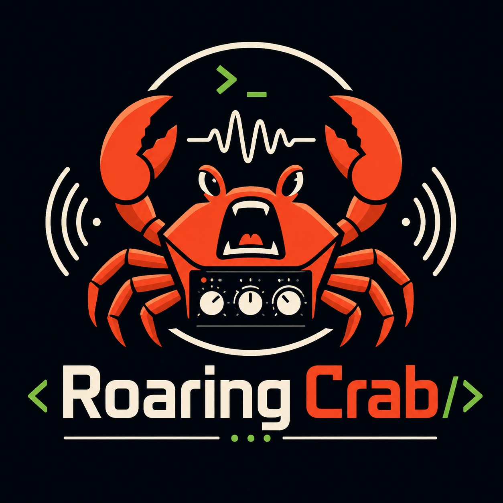

<p align="center">
  
</p>

# roaring-crab

A Claude Code plugin that plays generated analog-modeling synth sounds on hook events. Cross-platform (Linux, macOS, Windows). Sounds are abstract and musical — themed signature patches per hook with seeded variation.

## What it does

Every hook event in Claude Code (PreToolUse, Stop, Notification, etc.) triggers a short generated sound. Sounds are not files — they're synthesized in real time from oscillators, filters, and envelopes. Each hook has its own signature patch; each invocation seeds slight variation so it never sounds identical twice.

## Install

This plugin ships prebuilt binaries under `bin/<platform>/`. No Rust toolchain required to use it.

1. Add this repo to Claude Code as a plugin (per Claude Code's plugin install docs).
2. That's it. On the first hook fire, the launcher downloads the platform-appropriate binary archive from this repo's latest GitHub Release into `bin/<platform>/`. Subsequent events reuse the cached binary and the lazy-spawned daemon.

The download happens silently; if it fails (offline, GitHub down), the hook exits 0 and the next event will retry. Until the first download completes, the very first hook fire is silent.

**Requirements:** Node.js (always present when running Claude Code) and the `tar` binary. On Linux and macOS that's the default; on Windows 10 1803+ and Windows 11 the system ships `bsdtar` at `C:\Windows\System32\tar.exe`, which handles both `.tar.gz` and `.zip`.

### Platform notes

- **macOS**: binaries are ad-hoc signed in CI. On first run you may need to right-click → Open in Finder once to clear Gatekeeper, or run `xattr -dr com.apple.quarantine bin/macos-*/roaring-crab*`.
- **Linux**: requires an ALSA-compatible audio stack (default on most distros; PipeWire and PulseAudio work via ALSA emulation).
- **Windows**: no setup beyond installing the plugin.

## Config

User config lives at the platform-appropriate location:

- Linux: `~/.config/roaring-crab/config.toml`
- macOS: `~/Library/Application Support/roaring-crab/config.toml`
- Windows: `%APPDATA%\roaring-crab\config.toml`

Defaults are written on first run. Example:

```toml
master_volume = 0.7   # 0.0 – 1.0
muted = false

[enabled_hooks]
SessionStart      = true
SessionEnd        = true
UserPromptSubmit  = true
PreToolUse        = true
PostToolUse       = true
Notification      = true
Stop              = true
SubagentStop      = true
PreCompact        = true
```

Set `muted = true` to silence everything. Disable individual hooks under `[enabled_hooks]` to keep, say, Stop alerts but mute the ambient PreToolUse ticks.

## Verify install

Run the launcher directly:

```bash
# Unix
CLAUDE_PLUGIN_ROOT="$PWD" bash bin/launch.sh Stop

# Windows PowerShell
$env:CLAUDE_PLUGIN_ROOT = (Get-Location).Path
& bin\launch.cmd Stop
```

You should hear the Stop chord within a second or two (longer on the very first invocation as the daemon spawns).

## How it works

A long-lived daemon (`roaring-crabd`) owns the audio output device and a voice mixer. Each hook fires a short client (`roaring-crab --event <name>`) that sends a single `PlayEvent` message to the daemon over a local socket and exits in ~10–15ms. The daemon synthesizes the patch in real time with `fundsp` and mixes it into its `cpal` output stream. Overlapping events layer naturally. The daemon idle-exits after 5 minutes of no events.

## Build from source (developers only)

```bash
cargo build --release
cargo test --features null-audio
cargo run --release --example audition  # plays every patch
```

See `docs/superpowers/specs/2026-05-15-roaring-crab-design.md` for the design.

## License

Licensed under the [Apache License, Version 2.0](LICENSE).
